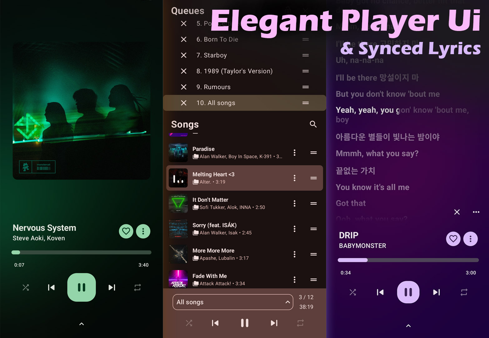

# OuterTune

A Material 3 YouTube Music client & local music player for Android

<!-- use  "⠀⠀" for spacing -->
⠀⠀
⠀⠀
⠀⠀
[](https://apps.obtainium.imranr.dev/redirect?r=obtainium://app/%7B%22id%22%3A%22com.dd3boh.outertune%22%2C%22url%22%3A%22https%3A%2F%2Fgithub.com%2FDD3Boh%2FOuterTune%22%2C%22author%22%3A%22DD3Boh%22%2C%22name%22%3A%22OuterTune%22%2C%22preferredApkIndex%22%3A0%2C%22additionalSettings%22%3A%22%7B%5C%22includePrereleases%5C%22%3Afalse%2C%5C%22fallbackToOlderReleases%5C%22%3Atrue%2C%5C%22filterReleaseTitlesByRegEx%5C%22%3A%5C%22%5C%22%2C%5C%22filterReleaseNotesByRegEx%5C%22%3A%5C%22%5C%22%2C%5C%22verifyLatestTag%5C%22%3Afalse%2C%5C%22dontSortReleasesList%5C%22%3Afalse%2C%5C%22useLatestAssetDateAsReleaseDate%5C%22%3Afalse%2C%5C%22trackOnly%5C%22%3Afalse%2C%5C%22versionExtractionRegEx%5C%22%3A%5C%22%5C%22%2C%5C%22matchGroupToUse%5C%22%3A%5C%22%5C%22%2C%5C%22versionDetection%5C%22%3Atrue%2C%5C%22releaseDateAsVersion%5C%22%3Afalse%2C%5C%22useVersionCodeAsOSVersion%5C%22%3Afalse%2C%5C%22apkFilterRegEx%5C%22%3A%5C%22%5C%22%2C%5C%22invertAPKFilter%5C%22%3Afalse%2C%5C%22autoApkFilterByArch%5C%22%3Atrue%2C%5C%22appName%5C%22%3A%5C%22%5C%22%2C%5C%22shizukuPretendToBeGooglePlay%5C%22%3Afalse%2C%5C%22allowInsecure%5C%22%3Afalse%2C%5C%22exemptFromBackgroundUpdates%5C%22%3Afalse%2C%5C%22skipUpdateNotifications%5C%22%3Afalse%2C%5C%22about%5C%22%3A%5C%22A%20Material%203%20YouTube%20Music%20client%20%26%20local%20music%20player%20for%20Android%5C%22%7D%22%2C%22overrideSource%22%3A%22GitHub%22%7D)

> [!WARNING]
> OuterTune is only available on the platforms listed here. This app is not listed on the Play Store or any other fake website that claim to be us. We recommend you to immediately delete any fake versions or clones for your safety.

## Features

OuterTune is a supercharged fork of [InnerTune](https://github.com/z-huang/InnerTune). This app is both a local media player, and a YouTube Music client.

- YouTube Music client features
    - Song downloading (offline playback)
    - Seamless playback: no ADs & background playback
    - Account synchronization
        - Full playlist sync from the app to the remote account is temporally unavailable 
- Local audio file playback (ex. MP3, OGG, FLAC, etc.)
    - Play local and Youtube Music songs at the same time
    - Uses a custom tag extractor instead of MediaStore's broken metadata extractor! (e.g tags delimited with \\ now show up properly)
- Sleek Material3 design
- Multiple queues
- Synchronized lyrics, and support for word by word/Karaoke lyrics formats (e.g LRC, TTML)
- Audio normalization, tempo/pitch adjustment, and various other audio effects
- Android Auto support
- Support for Android 8 (Oreo) and higher

> [!NOTE]
> Android 8 (Oreo) and higher is supported. While the app may work on Android 7.x (Nougat), we do not officially support this version

> [!NOTE]
> Read our FAQ and guides on our [wiki](https://github.com/OuterTune/OuterTune/wiki/Frequently-Asked-Questions-(FAQ))

## Screenshots

  

  

[Full image gallery](./assets/gallery)

> [!WARNING]
>
>If you're in a region where YouTube Music is not supported, you won't be able to use this app
***unless*** you have a proxy or VPN to connect to a YTM supported region.

## Building & Contributing

We are looking for contributors, translators, and maintainers! If you would like to help out, or just wish to build the
app yourself, please see the [building and contribution notes](./CONTRIBUTING.md).

### Submitting Translations

We use Weblate to translate OuterTune. For more details or to submit translations, visit our [Weblate page](https://hosted.weblate.org/projects/outertune/).

Thank you very much for helping to make OuterTune accessible to many people worldwide.

## Support us

If you like OuterTune, you're welcome to send a donation. Donations will support the development,
including bug fixes and new features.

## Help & Support
Contact us through GitHub
- For bug reports and/or feature requests, please create a [GitHub issue](https://github.com/OuterTune/OuterTune/issues).
- If you have want help with the app, check out the [Discussion Forum](https://github.com/OuterTune/OuterTune/discussions).

For all other inquiries NOT related to the app, you can contact us at outertune@protonmail.com. **This is NOT a support email!**

## Attribution

Thanks to all our contributors! Check them out [here](https://github.com/OuterTune/OuterTune/graphs/contributors)

[z-huang/InnerTune](https://github.com/z-huang/InnerTune) for providing an awesome base for this fork, none of this
would have been possible without it.

[Musicolet](https://play.google.com/store/apps/details?id=in.krosbits.musicolet) for inspiration of a local music player
experience done right.

[Gramophone](https://github.com/FoedusProgramme/Gramophone) for emotional support, and a legendary lyrics parser

## Disclaimer

This project and its contents are not affiliated with, funded, authorized, endorsed by, or in any
way associated with YouTube, Google LLC or any of its affiliates and subsidiaries.

Any trademark, service mark, trade name, or other intellectual property rights used in this project
are owned by the respective owners.
